# CloudDevOpsProject — iVolve DevOps Platform

<p align="center">
  <strong>End-to-End Cloud & DevOps Platform for a Microservices Application</strong>
</p>

<p align="center">
  <em>Containerization • Infrastructure as Code • Configuration Management • CI • Security Scanning • Kubernetes • AWS • GitOps • Argo CD</em>
</p>

---

> **Project scope:** A complete software-delivery platform that provisions AWS infrastructure, configures the CI server, builds and scans container images, publishes them to Amazon ECR, updates Kubernetes desired state in Git, and continuously reconciles that state into Amazon EKS with Argo CD.

---

## Table of Contents

- [1. Project Overview](#1-project-overview)
- [2. Project Objectives](#2-project-objectives)
- [3. Architecture at a Glance](#3-architecture-at-a-glance)
- [4. Application Architecture](#4-application-architecture)
- [5. DevOps Toolchain](#5-devops-toolchain)
- [6. AWS Infrastructure](#6-aws-infrastructure)
- [7. Infrastructure as Code with Terraform](#7-infrastructure-as-code-with-terraform)
- [8. Jenkins Server Configuration with Ansible](#8-jenkins-server-configuration-with-ansible)
- [9. Containerization and Docker Compose](#9-containerization-and-docker-compose)
- [10. Amazon ECR](#10-amazon-ecr)
- [11. Kubernetes Architecture](#11-kubernetes-architecture)
- [12. MySQL Stateful Workload and Persistent Storage](#12-mysql-stateful-workload-and-persistent-storage)
- [13. CI with Jenkins](#13-ci-with-jenkins)
- [14. Jenkins Shared Library](#14-jenkins-shared-library)
- [15. Container Security with Trivy](#15-container-security-with-trivy)
- [16. GitOps CD with Argo CD](#16-gitops-cd-with-argo-cd)
- [17. End-to-End CI/CD Flow](#17-end-to-end-cicd-flow)
- [18. Configuration and Secrets](#18-configuration-and-secrets)
- [19. Availability, Reliability, and Deployment Strategy](#19-availability-reliability-and-deployment-strategy)
- [20. Verification and Operational Checks](#20-verification-and-operational-checks)
- [21. Troubleshooting Lessons](#21-troubleshooting-lessons)
- [22. Repository Structure](#22-repository-structure)
- [23. Security Considerations](#23-security-considerations)
- [24. Project Deliverables](#24-project-deliverables)
- [25. Production-Readiness Improvements](#25-production-readiness-improvements)
- [26. Conclusion](#26-conclusion)

---

# 1. Project Overview

**CloudDevOpsProject — iVolve** is an end-to-end DevOps implementation around a small microservices web application.

The project demonstrates how an application can move from source code to a reproducible cloud environment through a sequence of automated engineering practices:

```text
Application Source
       │
       ▼
Docker / Docker Compose
       │
       ▼
Terraform
       │
       ├── AWS Network
       ├── Jenkins EC2
       ├── EKS Cluster
       └── ECR Repository
       │
       ▼
Ansible
       │
       └── Jenkins Host Configuration
       │
       ▼
Jenkins CI
       │
       ├── Build
       ├── Trivy Scan
       ├── Push Image → ECR
       └── Update Kubernetes Manifest
       │
       ▼
GitHub
       │
       ▼
Argo CD
       │
       ▼
Amazon EKS
       │
       ├── Frontend
       ├── Auth Service
       ├── Roadmap Service
       └── MySQL + Persistent EBS
```

The most important architectural principle is the separation between **CI** and **CD**:

> **Jenkins builds and publishes artifacts, then updates Git. Argo CD reads Git and reconciles Kubernetes.**

Jenkins does **not** directly deploy application manifests with `kubectl apply`. Git remains the desired-state source for the Kubernetes application.

---

# 2. Project Objectives

The project was designed to demonstrate the major building blocks of a modern DevOps workflow:

### Infrastructure

- Provision AWS infrastructure using Terraform.
- Separate reusable infrastructure into modules.
- Build a VPC with public and private subnets.
- Place the Jenkins server in a public subnet.
- Run EKS worker nodes in private subnets.
- Provision an ECR repository for container images.
- Store Terraform state remotely in Amazon S3.

### Configuration Management

- Use Ansible to configure the Jenkins host.
- Use dynamic AWS EC2 inventory rather than manually maintaining host IPs.
- Install and manage Java, Jenkins, Docker, and Trivy.

### Application Delivery

- Containerize each microservice.
- Provide a Docker Compose environment for local testing.
- Build service-specific images in Jenkins.
- Scan images before publishing them.
- Push images to Amazon ECR.

### Kubernetes

- Deploy stateless services using Deployments.
- Expose internal services with ClusterIP Services.
- Use an Ingress backed by the AWS Load Balancer Controller.
- Run MySQL as a StatefulSet.
- Persist MySQL data using an EBS CSI-backed StorageClass.

### GitOps

- Keep Kubernetes manifests in Git.
- Let Jenkins update image references.
- Let Argo CD continuously reconcile Git state with the EKS cluster.
- Enable automated sync, pruning, and self-healing.

---

# 3. Architecture at a Glance

## 3.1 End-to-End Project Architecture

The architecture below presents the platform as a complete delivery system rather than as a collection of independent tools. It highlights the three core domains of the project:

1. **Continuous Integration (CI)** — Jenkins builds, tests, scans, and publishes container images.
2. **GitOps Continuous Delivery (CD)** — Argo CD watches the Git desired state and reconciles Kubernetes resources.
3. **Cloud Runtime** — Amazon EKS runs the microservices and the stateful MySQL workload with persistent AWS storage.

<p align="center">
  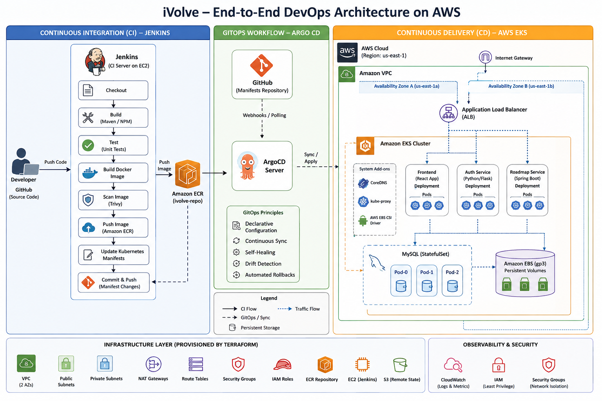
</p>

<p align="center">
  <sub><strong>Figure 1 — iVolve end-to-end DevOps architecture</strong></sub>
</p>

### 3.2 Architecture Principles

The platform is built around a clear separation of responsibilities:

| Layer | Responsibility | Primary Technologies |
|---|---|---|
| Source & Version Control | Application source, infrastructure code, CI definitions, and Kubernetes desired state | GitHub |
| Infrastructure | Provision and manage cloud resources declaratively | Terraform, AWS |
| Configuration Management | Configure and maintain the Jenkins host | Ansible |
| Continuous Integration | Build, test, scan, publish, and update deployment manifests | Jenkins, Docker, Trivy |
| Artifact Management | Store versioned container images | Amazon ECR |
| GitOps Delivery | Reconcile Git state with the Kubernetes cluster | Argo CD |
| Runtime Platform | Run application workloads and platform components | Amazon EKS, Kubernetes |
| Persistent Data | Provide durable storage for MySQL | EBS CSI, Amazon EBS |

### 3.3 CI/CD Boundary

A key architectural decision is the strict separation between **CI** and **CD**.

```text
                    CONTINUOUS INTEGRATION
Developer
    │
    ▼
 GitHub ───────────────► Jenkins
                            │
                            ├── Build
                            ├── Test
                            ├── Trivy Scan
                            ├── Push Image → ECR
                            └── Update Kubernetes Manifest
                                      │
                                      ▼
                                   GitHub
                                      │
                                      │ desired state
                                      ▼
                              ┌──────────────┐
                              │   Argo CD    │
                              │ GitOps / CD  │
                              └──────┬───────┘
                                     │
                              Sync / Reconcile
                                     │
                                     ▼
                               Amazon EKS
```

> **Jenkins does not directly deploy application manifests to EKS.**  
> Jenkins produces the deployable artifact and updates the desired state in Git. Argo CD is responsible for applying and continuously reconciling that desired state in Kubernetes.

### 3.4 Runtime Traffic Flow

```text
Internet
   │
   ▼
AWS Load Balancer / Ingress
   │
   ▼
Frontend Service
   │
   ├──────────────► Auth Service ─────────────► MySQL
   │
   └──────────────► Roadmap Service

MySQL
   │
   ▼
PersistentVolumeClaim
   │
   ▼
EBS CSI Driver
   │
   ▼
Amazon EBS
```

### 3.5 Infrastructure Boundary

Terraform establishes the cloud foundation required by the delivery platform:

```text
Terraform
   │
   ├── VPC
   │   ├── Public Subnets
   │   ├── Private Subnets
   │   ├── Internet Gateway
   │   ├── NAT Gateway
   │   └── Route Tables / Security Controls
   │
   ├── Jenkins EC2
   │
   ├── Amazon EKS
   │   └── Managed Node Group
   │
   └── Amazon ECR
```

Ansible then takes responsibility for configuring the Jenkins host:

```text
Jenkins EC2
     │
     ▼
Dynamic AWS Inventory
     │
     ▼
Ansible
     │
     ├── Java
     ├── Jenkins
     ├── Docker
     └── Trivy
```

## 3.6 Architecture at a Glance — Technical View

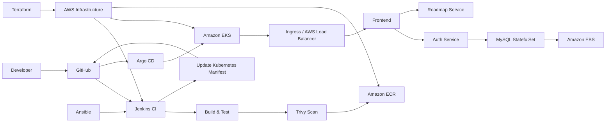

# 4. Application Architecture

The application follows a simple microservices model.

| Service | Technology | Port | Responsibility |
|---|---|---:|---|
| Frontend | Node.js / Express / EJS | 3000 | Web UI, authentication pages, roadmap UI |
| Auth Service | Python / Flask | 5000 | Signup/login and user persistence |
| Roadmap Service | Java / Spring Boot | 8080 | Roadmap-related application data |
| MySQL | MySQL 8 | 3306 | Persistent user data |

### Request flow

```text
Browser
   │
   ▼
Frontend :3000
   │
   ├──────────────► Auth Service :5000 ─────► MySQL :3306
   │
   └──────────────► Roadmap Service :8080
```

The application is intentionally separated so that the frontend is not responsible for database access.

The **auth-service** is the service that communicates with MySQL.

Inside Kubernetes, services communicate through Kubernetes DNS names such as:

```text
http://auth-service:5000
http://roadmap-service:8080
mysql:3306
```

This removes the need to hardcode pod IP addresses.

---

# 5. DevOps Toolchain

| Technology | Role in the project | Main value |
|---|---|---|
| GitHub | Source control / desired state | Versioned source and manifests |
| Docker | Containerization | Reproducible service packaging |
| Docker Compose | Local orchestration | Fast local integration testing |
| Terraform | Infrastructure as Code | Repeatable AWS provisioning |
| Amazon S3 | Terraform state backend | Central remote state |
| Ansible | Configuration management | Repeatable Jenkins host configuration |
| Jenkins | Continuous Integration | Build, scan, publish, manifest update |
| Trivy | Container security | HIGH/CRITICAL vulnerability visibility |
| Amazon ECR | Image registry | Private AWS-native container storage |
| Amazon EKS | Kubernetes platform | Managed control plane and worker orchestration |
| AWS Load Balancer Controller | Kubernetes-to-AWS integration | ALB provisioning from Ingress resources |
| EBS CSI Driver | Persistent storage | Dynamic EBS volume provisioning |
| Argo CD | Continuous Deployment / GitOps | Automated reconciliation and self-healing |

---

# 6. AWS Infrastructure

The AWS environment consists of:

- A dedicated VPC.
- Two public subnets.
- Two private subnets.
- Internet Gateway.
- NAT Gateway and Elastic IP.
- Public and private route tables.
- Network ACLs.
- Jenkins EC2 instance.
- Amazon EKS cluster.
- EKS managed node group.
- Amazon ECR repository.

## 6.1 Jenkins EC2

Terraform creates a Jenkins EC2 instance in a public subnet.

The instance:

- Uses the latest matching Amazon Linux 2023 AMI.
- Uses a configurable EC2 instance type.
- Receives a public IP.
- Allows SSH on port 22.
- Allows Jenkins UI access on port 8080.
- Is tagged as `ivolve-jenkins-server`.

The project then uses Ansible to configure that machine.

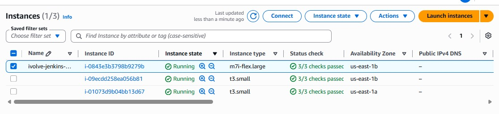

## 6.2 EKS

The EKS cluster is named:

```text
ivolve-eks
```

The worker node group is configured with:

- Two nodes.
- `t3.small` instances.
- Desired size: 2.
- Minimum: 2.
- Maximum: 2.
- Private subnet placement.

This creates a small but multi-node Kubernetes environment suitable for the project.

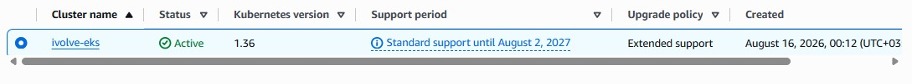

## 6.3 ECR

The project uses one Amazon ECR repository:

```text
ivolve-repo
```

Each service is distinguished through its image tag.

Example:

```text
ivolve-repo:frontend-21
ivolve-repo:auth-service-3
ivolve-repo:roadmap-service-1
```

Jenkins generates the actual build number dynamically; these examples represent build artifacts visible in the project rather than hardcoded deployment values.

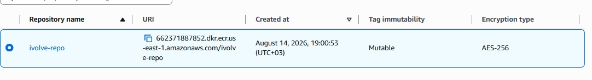

---

# 7. Infrastructure as Code with Terraform

Terraform is divided into reusable modules:

```text
Terraform/
├── main.tf
├── variables.tf
├── outputs.tf
├── providers.tf
├── backend.tf
└── modules/
    ├── Network/
    ├── Server/
    ├── EKS/
    └── ECR/
```

## 7.1 Root module

`Terraform/main.tf` composes the infrastructure:

```text
Network
   │
   ├── VPC
   ├── Public Subnets
   ├── Private Subnets
   ├── IGW
   └── NAT Gateway
        │
        ├── Server
        │    └── Jenkins EC2
        │
        └── EKS
             └── EKS + Node Group

ECR
└── ivolve-repo
```

Terraform module outputs are used to pass dependencies between modules instead of duplicating resource IDs.

For example, the Server module receives the VPC ID and a public subnet ID from the Network module.

## 7.2 Network module

The Network module creates:

- VPC: `10.0.0.0/16`
- Public subnet 1: `10.0.1.0/24`
- Public subnet 2: `10.0.2.0/24`
- Private subnet 1: `10.0.10.0/24`
- Private subnet 2: `10.0.20.0/24`
- Internet Gateway
- NAT Gateway
- Elastic IP
- Public route table
- Private route table
- Public NACL
- Private NACL

The private subnets are distributed across:

```text
us-east-1a
us-east-1b
```

## 7.3 Remote Terraform state

Terraform uses an Amazon S3 backend:

```hcl
terraform {
  backend "s3" {
    bucket = "terraform-state-devops-grad"
    key    = "terraform.tfstate"
    region = "us-east-1"
  }
}
```

This means Terraform state is not dependent on a developer's local machine.

> **Important implementation detail:** the provided project backend uses **S3 remote state**. It does not define DynamoDB locking in `backend.tf`, so this documentation does not claim DynamoDB locking.

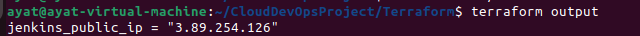

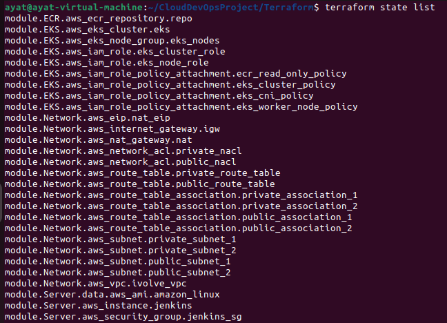

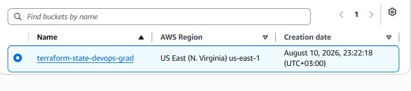

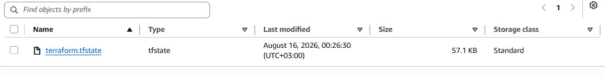

## 7.4 Terraform workflow

```bash
cd Terraform
terraform init
terraform plan
terraform apply
```

Typical lifecycle:

```text
terraform init
      │
      ▼
Backend + Provider Initialization
      │
      ▼
terraform plan
      │
      ▼
Review Infrastructure Changes
      │
      ▼
terraform apply
      │
      ▼
AWS Resources Created / Updated
```

---

# 8. Jenkins Server Configuration with Ansible

Terraform creates the Jenkins EC2 infrastructure; Ansible configures the operating system and Jenkins environment.

This gives the project a clean responsibility split:

```text
Terraform → "Create the server"
Ansible   → "Configure the server"
Jenkins   → "Run CI"
```

## 8.1 Dynamic AWS inventory

The inventory uses the `amazon.aws.aws_ec2` plugin.

It discovers the Jenkins EC2 instance through its AWS tag:

```text
Name = ivolve-jenkins-server
```

The inventory therefore does not depend on manually updating a static IP address whenever the infrastructure changes.

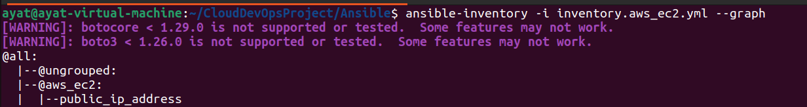

## 8.2 Jenkins role

The Jenkins role installs:

- Java 21 Amazon Corretto.
- Jenkins.
- Docker.
- Trivy.

It also ensures Jenkins and Docker are:

- Started.
- Enabled at boot.

The role uses Ansible modules rather than a long sequence of shell commands, making the configuration more declarative and repeatable.

## 8.3 Configuration flow

```text
AWS EC2
   │
   ▼
Dynamic Inventory
   │
   ▼
Ansible Playbook
   │
   ▼
jenkins role
   │
   ├── Java
   ├── Jenkins
   ├── Docker
   └── Trivy
```

### Evidence

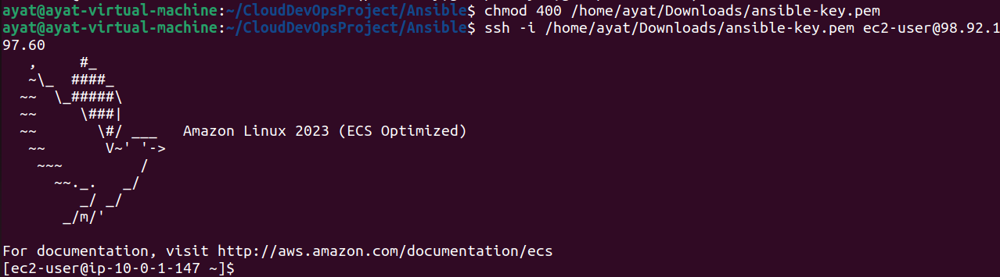

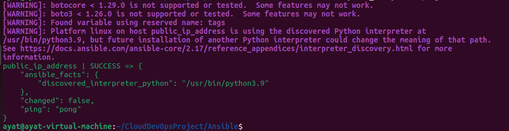

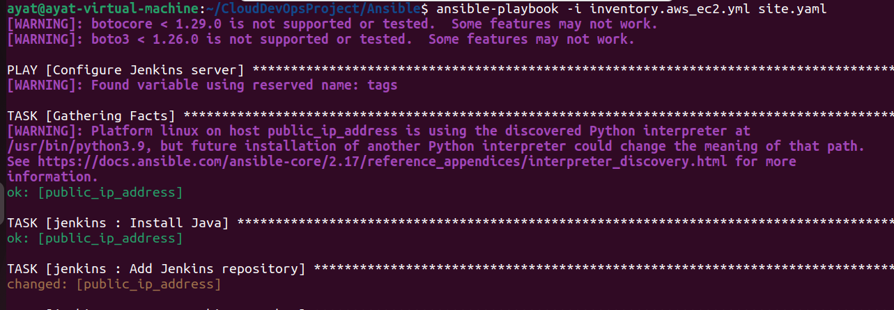

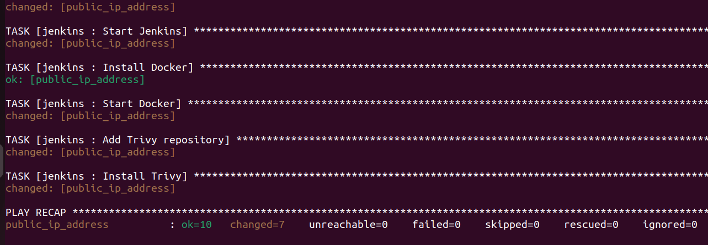

---

# 9. Containerization and Docker Compose

Each application service has its own Dockerfile.

The Docker Compose implementation is located under:

```text
Docker-Compose/
├── docker-compose.yml
├── app/
│   ├── auth-service/
│   ├── frontend/
│   └── roadmap-service/
└── screenshots/
```

## 9.1 Compose topology

```text
                    Docker Compose Network
                           │
        ┌──────────────────┼──────────────────┐
        │                  │                  │
        ▼                  ▼                  ▼
   frontend            auth-service      roadmap-service
      :3000                :5000               :8080
                             │
                             ▼
                           MySQL
                            :3306
```

The frontend receives service URLs through environment variables:

```text
AUTH_SERVICE_URL=http://auth-service:5000
ROADMAP_SERVICE_URL=http://roadmap-service:8080
```

The auth service uses:

```text
DB_HOST=mysql
DB_PORT=3306
DB_NAME=ivolve
```

This demonstrates an important containerization principle:

> Services communicate using service names on the container network rather than localhost or dynamically assigned IP addresses.

## 9.2 Local development

From the Compose directory:

```bash
cd Docker-Compose
docker compose up --build
```

The frontend is then available on:

```text
http://localhost:3000
```

To stop the environment:

```bash
docker compose down
```

Docker Compose is the **local integration environment**, while EKS is the **cloud orchestration environment**.

---

# 10. Amazon ECR

The CI system publishes service images to:

```text
662371887852.dkr.ecr.us-east-1.amazonaws.com/ivolve-repo
```

The pipeline dynamically builds:

```text
<registry>/<repository>:<service>-<build-number>
```

For example:

```text
frontend-21
auth-service-3
roadmap-service-1
```

The image lifecycle is:

```text
Dockerfile
   │
   ▼
docker build
   │
   ▼
Local image
   │
   ▼
Trivy scan
   │
   ▼
ECR login using AWS credentials
   │
   ▼
docker tag
   │
   ▼
docker push
```

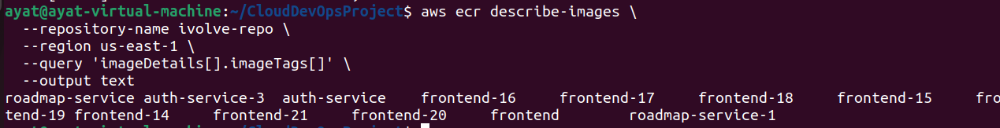

---

# 11. Kubernetes Architecture

The Kubernetes manifests are stored under:

```text
Kubernetes/
```

The cluster uses the namespace:

```text
ivolve
```

## 11.1 Resource model

```text
Namespace: ivolve
│
├── ConfigMap
├── Secret
│
├── frontend
│   ├── Deployment
│   └── ClusterIP Service
│
├── auth-service
│   ├── Deployment
│   └── ClusterIP Service
│
├── roadmap-service
│   ├── Deployment
│   └── ClusterIP Service
│
└── mysql
    ├── StatefulSet
    ├── Headless Service
    └── PersistentVolumeClaim
```

## 11.2 Services

The three application services are internal ClusterIP services.

```text
frontend
auth-service
roadmap-service
```

ClusterIP keeps them internal to the Kubernetes network.

The external entry point is the Ingress.

## 11.3 AWS ALB Ingress

The project uses:

```yaml
ingressClassName: alb
```

with:

```yaml
alb.ingress.kubernetes.io/scheme: internet-facing
alb.ingress.kubernetes.io/target-type: ip
```

The routing model is:

```text
Internet
   │
   ▼
AWS Application Load Balancer
   │
   ▼
frontend Service :3000
   │
   ├── auth-service :5000
   └── roadmap-service :8080
```

The AWS Load Balancer Controller is associated with an IAM role through:

```text
aws-load-balancer-controller-service-account.yaml
```

This allows Kubernetes Ingress resources to drive AWS load-balancer resources.

---

# 12. MySQL Stateful Workload and Persistent Storage

MySQL is different from the stateless microservices.

The application services can be recreated from container images, but database data must survive pod recreation.

Therefore MySQL is deployed using a **StatefulSet**.

## 12.1 Why StatefulSet?

A StatefulSet provides:

- Stable pod identity.
- Stable storage association.
- Ordered identity semantics.
- A suitable workload model for stateful applications.

The database pod is:

```text
mysql-0
```

## 12.2 Headless Service

The MySQL Service uses:

```yaml
clusterIP: None
```

This makes it a headless Service.

Its purpose is stable DNS-based discovery for the StatefulSet rather than load-balancing database traffic like a normal ClusterIP service.

## 12.3 StorageClass

The project defines:

```yaml
provisioner: ebs.csi.aws.com
volumeBindingMode: WaitForFirstConsumer
reclaimPolicy: Retain
```

and requests:

```text
10Gi
gp3
ext4
```

### Why EBS?

Amazon EBS provides block storage that can be attached to the worker node running the MySQL pod.

The EBS CSI driver allows Kubernetes to provision and attach EBS volumes through Kubernetes storage abstractions.

### Why `WaitForFirstConsumer`?

This delays volume provisioning until Kubernetes has enough scheduling context to place the workload.

For EBS, this is important because volumes are Availability-Zone-specific.

The simplified flow is:

```text
MySQL StatefulSet
       │
       ▼
PersistentVolumeClaim
       │
       ▼
StorageClass: ivolve-ebs-sc
       │
       ▼
EBS CSI Driver
       │
       ▼
Amazon EBS gp3 Volume
       │
       ▼
MySQL /var/lib/mysql
```

This was one of the most important operational parts of the project because MySQL storage is not equivalent to stateless application containers.

---

# 13. CI with Jenkins

There are three independent Jenkins pipelines:

```text
Jenkinsfile.auth
Jenkinsfile.frontend
Jenkinsfile.roadmap
```

All three follow the same lifecycle.

## 13.1 CI lifecycle

```text
Prepare Environment
        │
        ▼
Validate Repository Layout
        │
        ▼
Build Image
        │
        ▼
Scan Image
        │
        ▼
Push Image
        │
        ▼
Delete Local Image
        │
        ▼
Update Kubernetes Manifest
        │
        ▼
Push Manifest Changes to GitHub
```

## 13.2 Prepare environment

The pipeline determines the AWS account dynamically:

```bash
aws sts get-caller-identity
```

Then it constructs:

```text
AWS Account ID
ECR Registry
ECR Repository
Image URI
Local Image
```

The image tag is based on:

```groovy
IMAGE_TAG = "${env.BUILD_NUMBER}"
```

This avoids hardcoding a new image tag for every release.

## 13.3 Build

The shared function:

```text
buildImage.groovy
```

runs the Docker build against the appropriate service directory.

Examples:

```text
app/auth-service
app/frontend
app/roadmap-service
```

## 13.4 Push

The shared `pushImage` function:

1. Authenticates Docker to ECR.
2. Tags the local image.
3. Pushes the image.

The ECR password is retrieved dynamically from AWS rather than stored as a static Docker password.

## 13.5 Manifest update

After pushing the image, Jenkins updates the relevant Kubernetes Deployment:

```text
Kubernetes/auth-deployment.yaml
Kubernetes/frontend-deployment.yaml
Kubernetes/roadmap-deployment.yaml
```

The new image reference is committed back to GitHub.

This is the bridge between CI and GitOps CD.

### Evidence

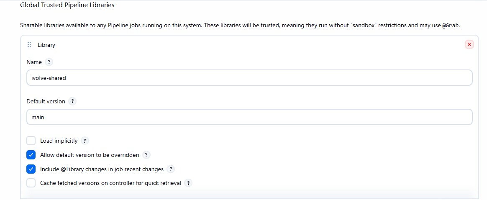

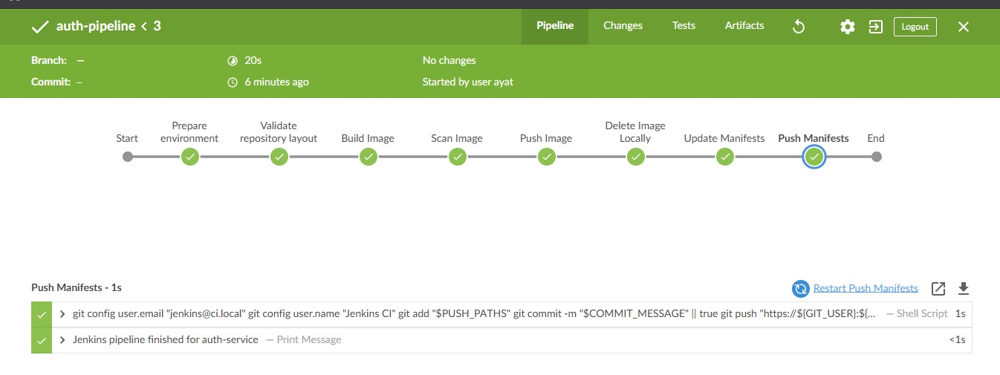

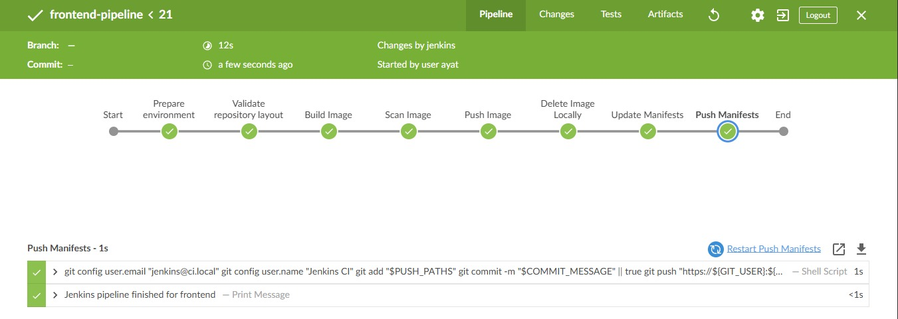

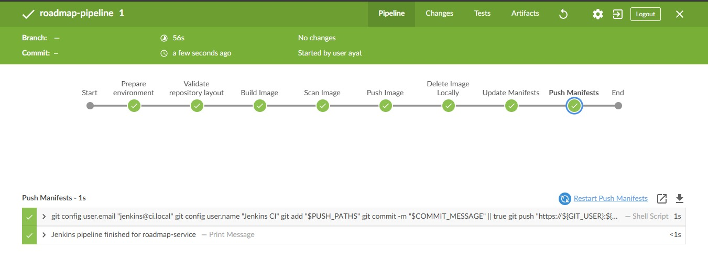

---

# 14. Jenkins Shared Library

A major maintainability decision is the use of a Jenkins Shared Library.

Located under:

```text
CI-CD/Jenkins/shared-library/vars/
```

It contains reusable functions such as:

```text
buildImage.groovy
scanImage.groovy
pushImage.groovy
deleteLocalImage.groovy
updateManifests.groovy
pushManifests.groovy
sonarScan.groovy
```

Instead of duplicating shell commands in every Jenkinsfile, each pipeline calls reusable functions.

For example:

```groovy
buildImage(
    context: env.APP_CONTEXT,
    localImage: env.LOCAL_IMAGE
)
```

This produces a cleaner separation:

```text
Jenkinsfile
    │
    └── Pipeline orchestration

Shared Library
    │
    ├── Build implementation
    ├── Scan implementation
    ├── Push implementation
    ├── Manifest update
    └── Git push
```

### Why this matters

Without a shared library, three pipelines would duplicate the same operational logic.

With a shared library:

- fixes can be applied centrally.
- pipelines stay readable.
- behavior stays consistent across services.
- adding another microservice becomes easier.

---

# 15. Container Security with Trivy

Trivy is installed on the Jenkins server through Ansible.

Each Docker image is scanned before it is pushed to ECR.

The shared library runs Trivy against:

```text
HIGH
CRITICAL
```

vulnerability severities.

Unfixed vulnerabilities are ignored through:

```text
--ignore-unfixed
```

The project currently configures:

```groovy
failOnCritical: false
```

This means the scan provides visibility without currently blocking the pipeline.

### Security interpretation

This is an intentional CI security checkpoint, but it should be tightened for a production environment.

A production pipeline could eventually enforce:

```text
Critical vulnerability → fail
High vulnerability     → fail or require approval
Medium/Low              → report
```

---

# 16. GitOps CD with Argo CD

Argo CD is responsible for continuous deployment.

The Argo CD Application is defined in:

```text
ArgoCd/application.yaml
```

Its source is GitHub and its target is the Kubernetes cluster.

Conceptually:

```text
GitHub
  │
  │ desired state
  ▼
Argo CD
  │
  │ reconciliation
  ▼
EKS
```

## 16.1 Recursive manifest discovery

The Application uses:

```yaml
directory:
  recurse: true
  exclude: "*.json"
```

This is important because the Kubernetes repository contains nested resources, including the `mysql/` directory.

The JSON files are IAM/policy documents rather than Kubernetes manifests, so excluding them prevents Argo CD from trying to treat them as Kubernetes resources.

## 16.2 Automated sync

The Application enables:

```yaml
automated:
  prune: true
  selfHeal: true
```

### Automated sync

Git changes can automatically become cluster changes.

### Prune

Resources removed from Git can be removed from the cluster.

### Self-heal

If a managed resource is changed manually in the cluster and differs from Git, Argo CD can reconcile it back toward the declared Git state.

This is the essence of GitOps:

> **The cluster is continuously reconciled toward the state declared in Git.**

### Evidence

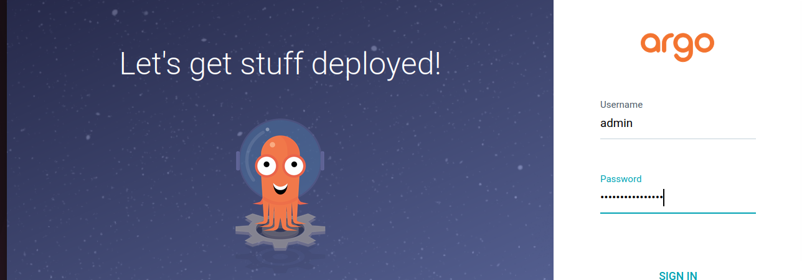

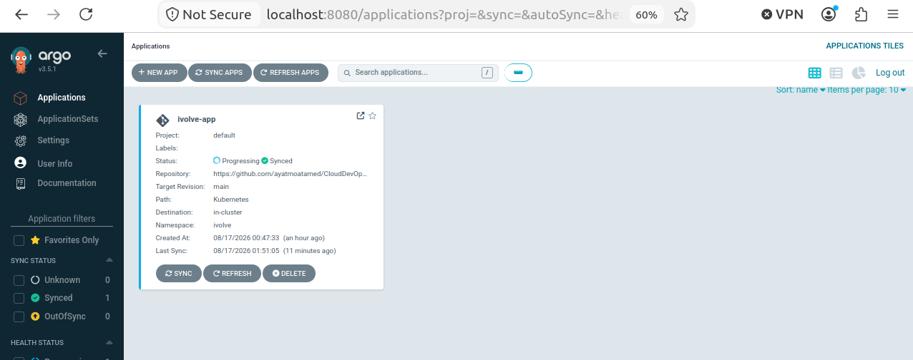

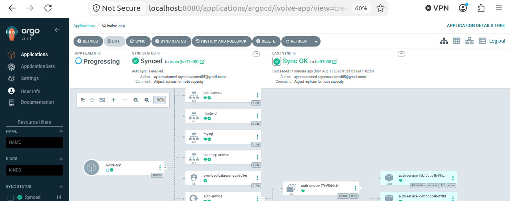

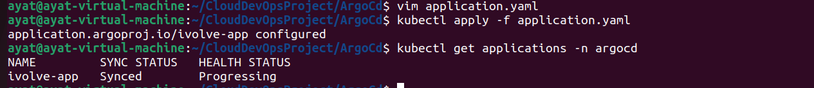

---

# 17. End-to-End CI/CD Flow

The complete delivery workflow can be summarized as:

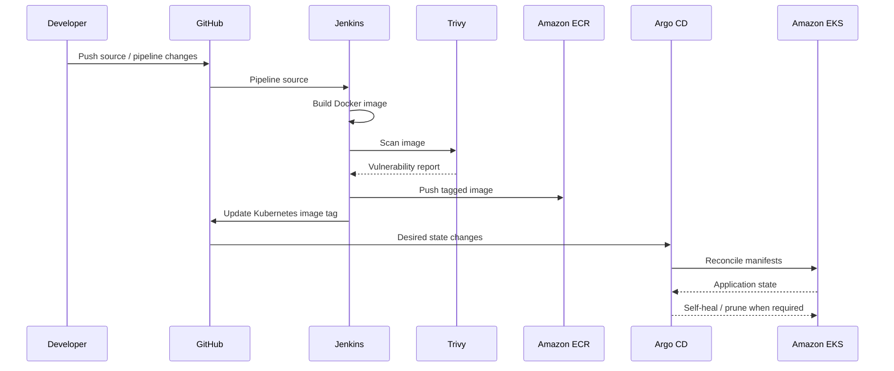

### The architectural boundary

The project intentionally avoids:

```text
Jenkins → kubectl apply → EKS
```

Instead:

```text
Jenkins → GitHub → Argo CD → EKS
```

That makes Git the auditable deployment source.

---

# 18. Configuration and Secrets

Kubernetes application configuration is separated into:

```text
ConfigMap
Secret
```

## ConfigMap

Contains non-sensitive values such as:

```text
DB_HOST
DB_PORT
DB_USER
DB_NAME
AUTH_SERVICE_URL
ROADMAP_SERVICE_URL
```

## Secret

Contains sensitive values such as:

```text
DB_PASSWORD
SESSION_SECRET
```

Deployments consume both using `envFrom`.

### Important security note

The current repository example uses Kubernetes `stringData` and contains development credentials.

For a real production environment, these values should not be committed in plaintext.

Recommended alternatives:

- AWS Secrets Manager.
- External Secrets Operator.
- Sealed Secrets.
- Vault.
- SOPS with KMS.

The important design principle is:

> **Application manifests should describe how secrets are consumed, not expose production credentials.**

---

# 19. Availability, Reliability, and Deployment Strategy

The project uses two EKS worker nodes across two private subnets / Availability Zones.

This gives the cluster more resilience than a single-node deployment.

The application services are stateless and can be recreated from their images.

MySQL is handled separately through StatefulSet + persistent storage.

## Deployment strategy

The provided Deployments use:

```yaml
strategy:
  type: RollingUpdate
  rollingUpdate:
    maxSurge: 0
    maxUnavailable: 1
```

This is a conservative strategy for a small two-node cluster.

It limits additional pod creation while allowing one unavailable replica during replacement.

> **Important:** this documentation reflects the actual manifests supplied for this project; it does not describe the different `Recreate` strategy used by the reference documentation.

## Why separate stateful and stateless workloads?

```text
Stateless
Frontend
Auth
Roadmap
   │
   └── Safe to recreate from image

Stateful
MySQL
   │
   └── Requires persistent storage
```

This separation is fundamental to reliable Kubernetes architecture.

---

# 20. Verification and Operational Checks

Useful checks during deployment include:

## Cluster health

```bash
kubectl get nodes
```

## All application pods

```bash
kubectl get pods -n ivolve
```

## Services

```bash
kubectl get svc -n ivolve
```

## Persistent storage

```bash
kubectl get pvc -n ivolve
```

## StatefulSet

```bash
kubectl get statefulset -n ivolve
```

## Ingress

```bash
kubectl get ingress -n ivolve
```

## Argo CD

```bash
kubectl get applications -n argocd
```

These checks provide a useful operational progression:

```text
Nodes
  ↓
Pods
  ↓
Services
  ↓
Ingress
  ↓
PVC / Storage
  ↓
Argo CD Application
  ↓
External application
```

---

# 21. Troubleshooting Lessons

One of the most valuable parts of the implementation was handling persistent storage after recreating the EKS environment.

## 21.1 PVC stuck in Pending

A MySQL PVC can remain:

```text
Pending
```

even when the StatefulSet itself exists.

The important distinction is:

```text
StatefulSet exists
        ≠
PersistentVolume exists
        ≠
EBS volume is provisioned and attached
```

The storage path must work end-to-end:

```text
PVC
 ↓
StorageClass
 ↓
EBS CSI Driver
 ↓
AWS EBS API
 ↓
EBS volume
 ↓
Node attachment
 ↓
MySQL pod
```

## 21.2 EBS CSI driver

The cluster needs the EBS CSI driver to provision EBS volumes through:

```text
ebs.csi.aws.com
```

Checking the driver:

```bash
kubectl get pods -n kube-system | grep ebs
```

Checking the PVC:

```bash
kubectl get pvc -n ivolve
```

Checking the StatefulSet:

```bash
kubectl describe statefulset mysql -n ivolve
```

The troubleshooting experience demonstrates an important Kubernetes lesson:

> **A Kubernetes storage manifest is only the declaration. The storage driver and AWS-side permissions are what make dynamic provisioning possible.**

## 21.3 StorageClass mismatch

Another important issue is that the StatefulSet's `volumeClaimTemplates` reference a specific StorageClass:

```yaml
storageClassName: ivolve-ebs-sc
```

Changing immutable parts of an existing StatefulSet can produce errors such as:

```text
spec: Forbidden: updates to statefulset spec for fields other than ...
```

In that situation, the correct approach is to understand which StatefulSet fields are immutable and, when appropriate, recreate the StatefulSet carefully while protecting persistent data.

---

# 22. Repository Structure

The actual project structure is:

```text
.
├── Ansible/
│   ├── inventory.aws_ec2.yml
│   ├── README.md
│   ├── site.yaml
│   └── roles/
│       └── jenkins/
│           └── tasks/
│               └── main.yaml
│
├── app/
│   ├── auth-service/
│   ├── frontend/
│   └── roadmap-service/
│
├── ArgoCd/
│   └── application.yaml
│
├── CI-CD/
│   └── Jenkins/
│       ├── Jenkinsfile.auth
│       ├── Jenkinsfile.frontend
│       ├── Jenkinsfile.roadmap
│       └── shared-library/
│           └── vars/
│
├── Docker-Compose/
│   ├── app/
│   ├── docker-compose.yml
│   ├── README.md
│   └── screenshots/
│
├── Kubernetes/
│   ├── namespace.yaml
│   ├── config/
│   │   ├── configmap.yaml
│   │   └── secret.yaml
│   ├── auth-deployment.yaml
│   ├── auth-service.yaml
│   ├── frontend-deployment.yaml
│   ├── frontend-service.yaml
│   ├── roadmap-deployment.yaml
│   ├── roadmap-service.yaml
│   ├── ingress.yaml
│   ├── aws-load-balancer-controller-service-account.yaml
│   └── mysql/
│       ├── storageclass.yaml
│       ├── statefulset.yaml
│       ├── headless-service.yaml
│       └── IAM / trust policy JSON files
│
├── Terraform/
│   ├── backend.tf
│   ├── main.tf
│   ├── providers.tf
│   ├── variables.tf
│   ├── outputs.tf
│   └── modules/
│       ├── Network/
│       ├── Server/
│       ├── EKS/
│       └── ECR/
│
└── screenshots/
```

This structure separates the major DevOps concerns while keeping the application source and deployment automation in one repository.

---

# 23. Security Considerations

Security is addressed at multiple layers.

## AWS / IAM

The project uses IAM roles and managed policies for AWS integrations instead of embedding AWS access keys in Terraform or pipeline shell commands.

Relevant integrations include:

- EKS cluster role.
- EKS worker node role.
- ECR read access for nodes.
- AWS Load Balancer Controller IAM role.
- Jenkins AWS credentials binding.

## CI Security

Trivy scans container images before publication.

## Kubernetes

Namespaces provide logical isolation.

Secrets are separated from normal configuration.

## GitOps

Argo CD provides an auditable deployment path through Git.

## Remaining security improvements

The current project should not be treated as production-secure without further hardening.

Recommended improvements:

- Remove plaintext development secrets.
- Restrict Jenkins port 8080.
- Restrict SSH access.
- Use HTTPS for public application access.
- Add Kubernetes NetworkPolicies.
- Use least-privilege IAM policies instead of broad managed policies where possible.
- Enable ECR image scanning / lifecycle policies.
- Add admission policies.
- Protect the GitHub main branch.
- Require pull-request review for production manifests.

---

# 24. Project Deliverables

| Requirement | Implementation |
|---|---|
| Application source | `app/` |
| Dockerfiles | Each microservice directory |
| Docker Compose | `Docker-Compose/docker-compose.yml` |
| Terraform | `Terraform/` |
| AWS Network | `Terraform/modules/Network` |
| Jenkins EC2 | `Terraform/modules/Server` |
| EKS | `Terraform/modules/EKS` |
| ECR | `Terraform/modules/ECR` |
| Remote Terraform state | `Terraform/backend.tf` |
| Ansible | `Ansible/` |
| Dynamic inventory | `Ansible/inventory.aws_ec2.yml` |
| Jenkins configuration | `Ansible/roles/jenkins` |
| Kubernetes | `Kubernetes/` |
| MySQL persistence | `Kubernetes/mysql/` |
| AWS ALB integration | `Kubernetes/ingress.yaml` + controller ServiceAccount |
| Jenkins CI | `CI-CD/Jenkins/` |
| Shared pipeline logic | `CI-CD/Jenkins/shared-library/vars` |
| Image security | Trivy |
| GitOps | `ArgoCd/application.yaml` |
| Evidence | `screenshots/` |

---

# 25. Production-Readiness Improvements

The project provides a strong DevOps foundation. A production evolution could include:

### CI/CD

- GitHub webhooks for automatic Jenkins triggering.
- Pull-request validation pipelines.
- Quality gates.
- Dependency scanning.
- SBOM generation.
- Image signing with Cosign.
- Promotion between environments.

### Kubernetes

- Helm or Kustomize for environment overlays.
- Horizontal Pod Autoscaler.
- PodDisruptionBudgets.
- Resource requests and limits.
- Liveness/readiness/startup probes.
- NetworkPolicies.
- Separate namespaces for dev/staging/prod.

### Secrets

- AWS Secrets Manager.
- External Secrets Operator.
- Automatic secret rotation.

### Observability

- Prometheus.
- Grafana.
- Centralized logs.
- Alerting.
- Distributed tracing.

### Reliability

- Automated MySQL backups.
- EBS snapshot strategy.
- Disaster recovery testing.
- Multi-environment deployment.
- Argo Rollouts for canary or blue/green releases.

### Infrastructure

- Stronger IAM least privilege.
- S3 state encryption and access controls.
- State locking strategy.
- VPC endpoints where appropriate.
- Private Jenkins access through VPN/SSM rather than unrestricted Internet exposure.

---

# 26. Conclusion

The iVolve DevOps platform demonstrates the complete path from application source code to a cloud-hosted Kubernetes workload.

The project is intentionally built as a chain of responsibilities:

```text
Terraform
    ↓
AWS Infrastructure

Ansible
    ↓
Configured Jenkins Server

Docker
    ↓
Portable Application Images

Jenkins
    ↓
Continuous Integration + Security Scan + ECR

GitHub
    ↓
Desired Kubernetes State

Argo CD
    ↓
GitOps Reconciliation

Amazon EKS
    ↓
Running Microservices

EBS
    ↓
Persistent MySQL Data
```

The strongest architectural characteristic is the **CI/CD separation**:

> Jenkins is responsible for producing and publishing application artifacts and updating the desired state in Git, while Argo CD is responsible for continuously reconciling that desired state into Kubernetes.

This provides:

- Reproducible infrastructure.
- Automated configuration.
- Repeatable application builds.
- Container security scanning.
- Private image storage.
- Kubernetes orchestration.
- Persistent database storage.
- Git-based deployment history.
- Automated synchronization and self-healing.

The project therefore demonstrates not only how to deploy an application, but how the individual DevOps practices connect into a coherent software delivery platform.

---

## Project Evidence

The repository includes screenshots covering:

- Terraform provisioning and state.
- AWS VPC and EC2 resources.
- ECR.
- EKS.
- Ansible dynamic inventory and execution.
- Jenkins shared library and pipelines.
- Argo CD deployment and application tree.

These screenshots are intentionally placed alongside the relevant technical sections rather than being treated as an unrelated appendix.

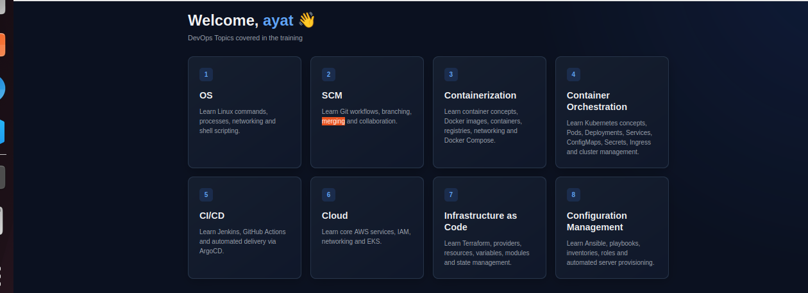

---

> **Note:** This README documents the implementation represented by the project files supplied for this repository. Where the reference documentation differs from the actual implementation, this README follows the actual project structure and manifests.

